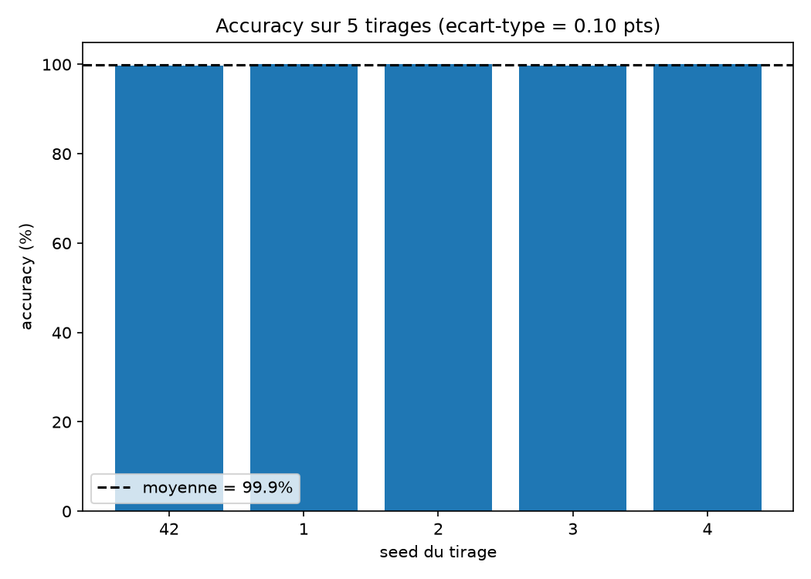
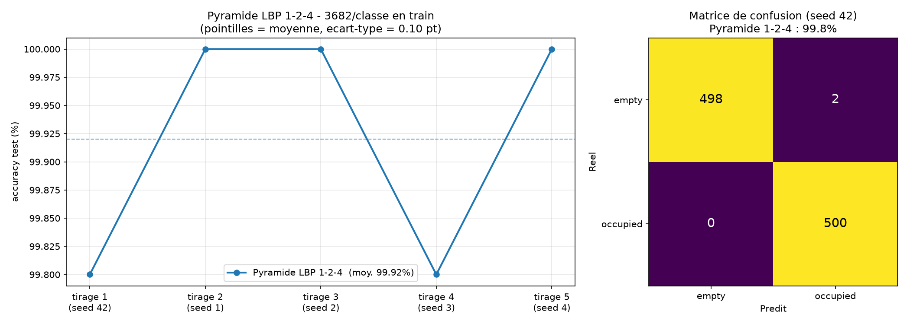
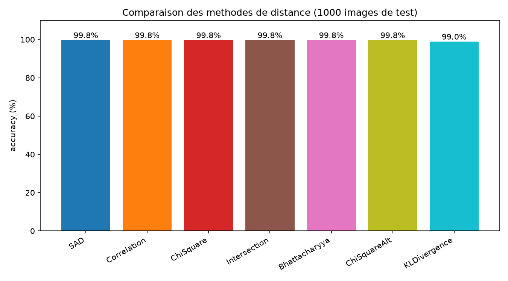
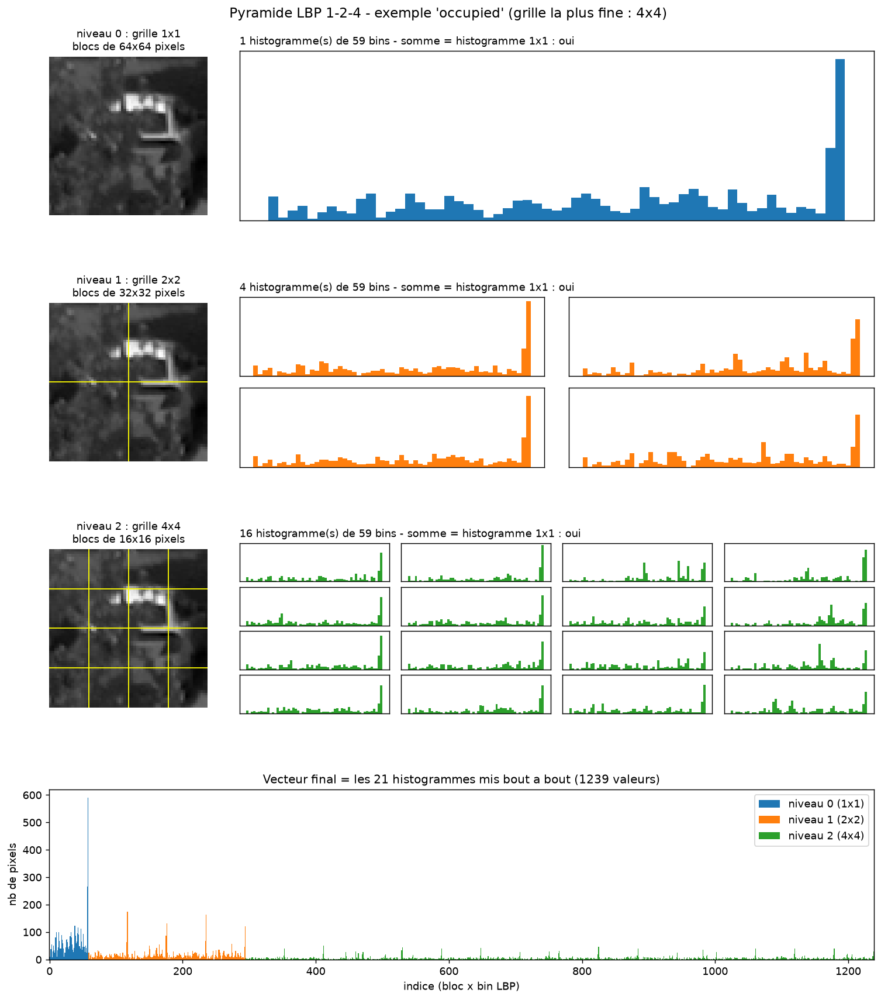
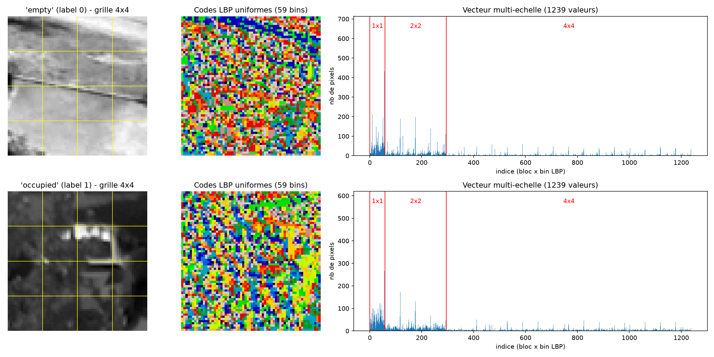
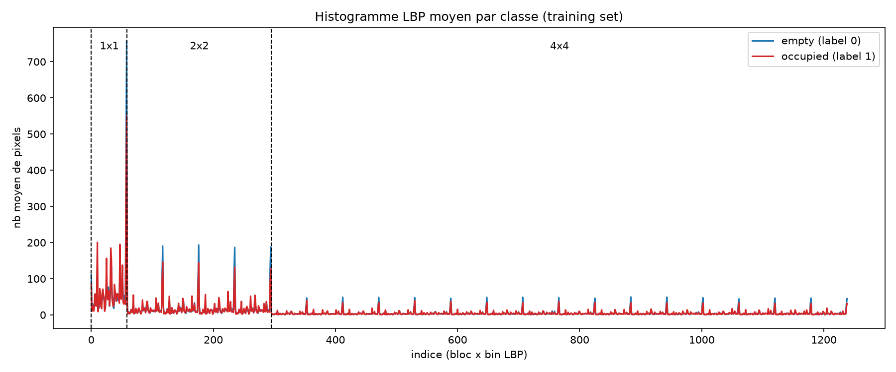
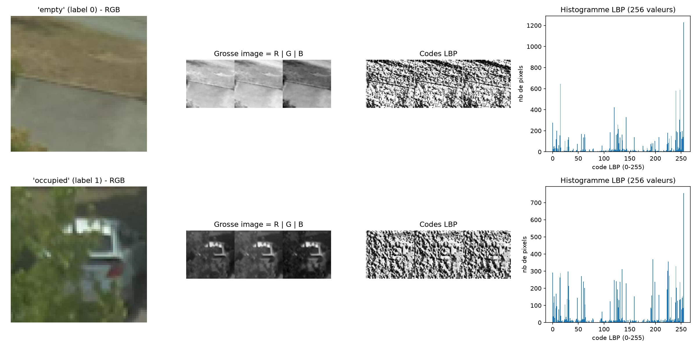
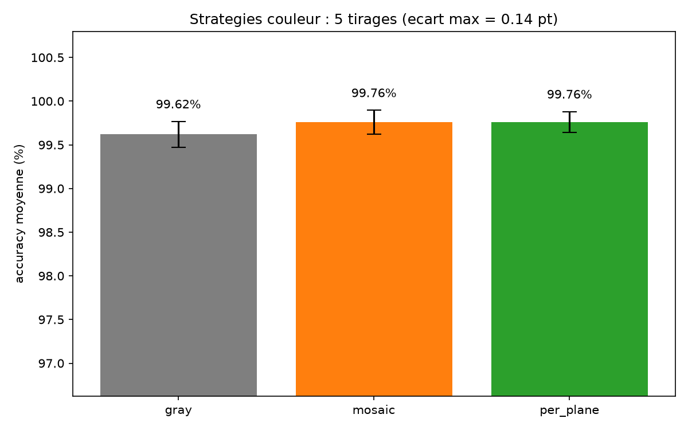
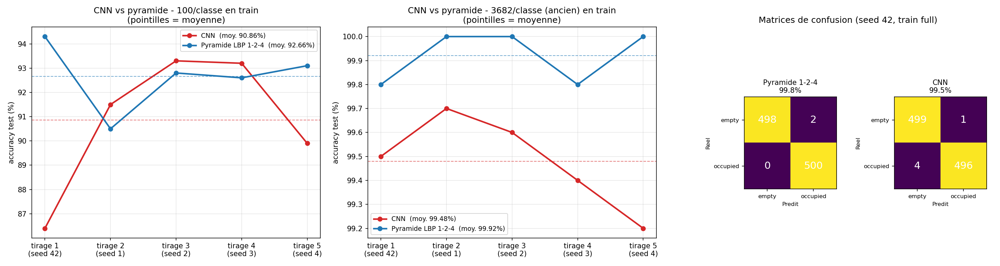

# PKLot — Caractérisation de scène : détection d'occupation de places de parking

Projet réalisé dans le cadre du cours de caractérisation de scène (Master IM,
Université de Haute-Alsace). Objectif : classer automatiquement une image de
place de parking comme **vide** ou **occupée**, à partir du dataset PKLot.

`parking_v6.py` est un script **autonome** : il contient tout le pipeline de la
v5 (RGB → LBP global, 7 distances, validation croisée, chronométrage) et y
ajoute une nouvelle caractérisation **LBP multi-échelle par blocs**. Le mode se
choisit avec la constante `FEATURE_MODE` :

| `FEATURE_MODE` | Caractéristiques | Taille du vecteur |
|---|---|---|
| `"multiscale"` (défaut) | gris → LBP uniforme → histogrammes par blocs 1×1, 2×2, 4×4 | 1239 |
| `"mosaic"` (alias `"global"`) | RGB → R\|G\|B côte à côte → un seul LBP → histogramme | 256 |
| `"gray"` | niveaux de gris → LBP global → histogramme (référence) | 256 |
| `"per_plane"` | un LBP par plan R, G, B → 3 histogrammes concaténés | 768 |

## Pipeline

1. **Dataset** : `database/{A,B}/{busy,free}`. Les sous-dossiers A et B sont
   combinés par classe, puis séparés aléatoirement en train / test (le test
   set est réservé en premier pour ne jamais se retrouver vide).
2. **Caractérisation** (au choix) :
   - *multiscale* (pyramide LBP 1-2-4) : image en niveaux de gris 64×64, LBP
     (8 voisins, rayon 1) avec mapping *uniform* (58 motifs uniformes + 1 bin
     « autres » = 59 bins). On construit ensuite une pyramide d'histogrammes
     sur des blocs de plus en plus petits :
     - niveau 0 : **1** histogramme sur l'image entière (64×64) ;
     - niveau 1 : **4** histogrammes sur des blocs 2 fois plus petits (32×32) ;
     - niveau 2 : **16** histogrammes sur des blocs encore 2 fois plus petits (16×16).

     À la fin, les 21 histogrammes sont mis bout à bout pour former le vecteur
     final : 59 × 21 = **1239 valeurs**. À chaque niveau, les histogrammes des
     blocs additionnés redonnent exactement l'histogramme de l'image entière :
     chaque niveau a donc la même masse totale (nombre de pixels), et aucun ne
     domine la distance.
   - *mosaic* : image RGB séparée en 3 canaux concaténés côte à côte en une
     « grosse image », LBP sur cette image, histogramme de 256 codes.
   - *gray* et *per_plane* : voir l'extension à la couleur ci-dessous.
3. **Modèle** : `model.txt` contient le vecteur de chaque image
   d'entraînement avec son label (0 = vide, 1 = occupée).
4. **Classification** : 1-plus-proche-voisin avec la distance **SAD**
   (Sum of Absolute Differences), vectorisée en numpy (float32 : les distances
   sont des entiers, donc restent exactes). Résultat dans `test.txt`.
5. **Comparaison de distances** : le même test set est classé avec 7 méthodes
   (SAD + 6 équivalents de `cv2.compareHist` : Correlation, ChiSquare,
   Intersection, Bhattacharyya, ChiSquareAlt, KLDivergence), calculées en
   numpy, en float32 et en parallèle (threads) avec suivi de l'avancement.
6. **Validation croisée** : le pipeline est répété sur **5 tirages au
   maximum** (seeds 42, 1, 2, 3, 4) pour limiter le temps de calcul ; la
   comparaison couleur réutilise ces mêmes 5 tirages. Le tirage 42 est le
   tirage « officiel » qui écrit les fichiers de sortie ; les vecteurs de
   chaque image sont mis en cache pour n'être extraits qu'une seule fois.
7. **Chronométrage** : chaque étape est chronométrée, résumé en fin
   d'exécution.

## Utilisation

```bash
pip install pillow numpy matplotlib

python parking_v6.py
```

Le script attend un dossier `database/` (chemin réglé par `DATA_DIR` en haut
du script) organisé ainsi :

```
database/
    A/
        busy/    *.jpg
        free/    *.jpg
    B/
        busy/    *.jpg
        free/    *.jpg
```

Les noms `free`/`busy`, `empty`/`occupied` et `vacant`/`taken` sont reconnus
automatiquement (insensible à la casse). `python parking_v6.py --color-only`
ne lance que la comparaison des stratégies couleur. Une exécution complète
(validation croisée + comparaison couleur) prend environ 25 à 30 minutes ; la
validation croisée seule ~15 minutes (dont ~3 min pour la comparaison des 7
distances), la comparaison couleur ~9 minutes.

## Sorties (dossier `resultats_v6/`, non versionné)

Les résultats sont rangés par étape du pipeline :

```
resultats_v6/
├── 1_modele/
│   ├── model.txt                  vecteurs d'entraînement (label;v1,v2,...)
│   └── test.txt                   prédictions SAD (chemin;label_reel;label_predit;distance_min)
├── 2_caracterisation/
│   ├── pyramide_histogrammes_empty.png     construction de la pyramide, niveau par niveau
│   ├── pyramide_histogrammes_occupied.png
│   ├── multi_echelle_exemple.png  image + grille, codes LBP, vecteur multi-échelle
│   │                              (mode mosaic : histogramme_exemple.png)
│   └── histogramme_moyen.png      vecteur moyen par classe
├── 3_distances/
│   ├── comparaison_distances.txt  prédictions des 7 méthodes de distance
│   └── comparaison_distances.png  accuracy comparée des 7 méthodes
├── 4_pyramide_tirages/
│   ├── pyramide_tirages.csv       accuracy de la pyramide 1-2-4 par tirage + moyenne / écart-type
│   ├── pyramide_tirages.png       accuracy par tirage + matrice de confusion (seed 42)
│   └── validation_croisee.png     accuracy sur les 5 tirages (barres)
├── 5_couleur/
│   ├── comparaison_couleur.txt    accuracy des 3 stratégies couleur par tirage
│   ├── comparaison_couleur.png
│   └── mosaique_couleur.png       construction de la mosaïque R | G | B
└── chronometre.txt                durée de chaque étape
```

## Résultats (mode `multiscale`, 3682 images d'entraînement et 500 de test par classe)

Validation croisée (SAD, 1-NN) :

| seed | 42 | 1 | 2 | 3 | 4 |
|---|---|---|---|---|---|
| accuracy | 99,8 % | 100 % | 100 % | 99,8 % | 100 % |

Accuracy moyenne : **99,9 %** (écart-type 0,10 point).



Pyramide LBP 1-2-4 tirage par tirage (pointillés = moyenne) et matrice de confusion du tirage officiel :



Comparaison des distances sur le tirage officiel (seed 42) :

| Méthode | Accuracy |
|---|---|
| SAD, Correlation, ChiSquare, Intersection, Bhattacharyya, ChiSquareAlt | 99,8 % |
| KLDivergence | 99,0 % |



### Construction de la pyramide

Pour un exemple « occupé » : 1 histogramme sur l'image entière, puis 4
histogrammes sur des blocs 2 fois plus petits, puis 16 sur des blocs encore 2
fois plus petits. En bas, les 21 histogrammes mis bout à bout forment le
vecteur final de 1239 valeurs. Le titre de chaque niveau vérifie que la somme
de ses histogrammes redonne bien l'histogramme de l'image entière.



### Illustration du pipeline multi-échelle

Pour un exemple par classe : l'image en niveaux de gris avec la grille 4×4, les
codes LBP uniformes, et le vecteur de 1239 valeurs (blocs 1×1 | 2×2 | 4×4).



### Vecteur moyen par classe

Vecteur multi-échelle moyen sur le training set. Les deux courbes sont proches
en moyenne : les images « vides » ont des pics un peu plus marqués (notamment
sur le bin « non uniforme » de chaque bloc). La séparation se joue donc sur des
différences fines, bloc par bloc, que le 1-NN exploite image par image.



## Extension à la couleur

Le LBP est défini sur un canal unique. Une image couleur (`CV_8UC3`) est donc
séparée en ses trois plans R, G et B, juxtaposés horizontalement en une seule
image de largeur 3W sur laquelle un unique LBP est calculé (la *mosaïque*).



Trois stratégies sont comparées avec exactement les mêmes découpages
train / test sur les **5 tirages** de la validation croisée (SAD, 1-NN, 256 ou
768 valeurs, sans blocs) :

| Stratégie | Accuracy moyenne | Écart-type |
|---|---|---|
| `gray` (référence) | 99,62 % | 0,15 pt |
| `mosaic` (R\|G\|B, un LBP) | 99,76 % | 0,14 pt |
| `per_plane` (un LBP par plan) | 99,76 % | 0,12 pt |



Les trois stratégies sont à moins de **0,14 point** l'une de l'autre, et la
mosaïque et le LBP par plan ont la même moyenne. Sur ce jeu de données la
couleur n'apporte donc qu'un gain très faible : chacune des deux stratégies
couleur fait mieux ou aussi bien que le gris sur 4 tirages sur 5 (fichier
`comparaison_couleur.txt`), mais l'écart reste du même ordre que la
variabilité entre tirages.

Une explication plausible : le LBP compare chaque voisin au pixel central, il
est donc invariant aux changements monotones d'intensité, et les trois plans
portent en grande partie la même texture locale, même lorsqu'ils diffèrent en
luminosité. Cette explication n'est pas testée ici : seuls les chiffres
ci-dessus sont mesurés.

## Deep learning (CNN)

Le dossier [`deep_learning/`](deep_learning/README.md) compare un CNN à 2 classes
(Keras / TensorFlow) aux méthodes LBP + 1-NN, sur les mêmes tirages. Avec le
protocole complet, le CNN atteint 99,48 % contre 99,92 % pour la pyramide LBP
1-2-4.



## Paramètres principaux (`parking_v6.py`)

| Constante | Rôle |
|---|---|
| `DATA_DIR`, `SUB_FOLDERS` | chemin du dataset et sous-dossiers combinés |
| `FEATURE_MODE` | `"multiscale"`, `"mosaic"` (`"global"`), `"gray"` ou `"per_plane"` |
| `COLOR_STRATEGIES`, `COLOR_SEEDS` | stratégies et tirages de la comparaison couleur (= `CV_SEEDS`, 5 tirages) |
| `RUN_COLOR_COMPARISON` | lance la comparaison couleur après la validation croisée |
| `GRID_SCALES` | grilles de la pyramide multi-échelle (défaut `[1, 2, 4]`) |
| `N_TRAIN_PER_CLASS` / `N_TEST_PER_CLASS` | taille du split par classe |
| `RESIZE_SIZE` | taille de redimensionnement avant extraction |
| `CV_SEEDS` | graines des 5 tirages de la validation croisée |
| `RESULT_DIR` | dossier des sorties |
